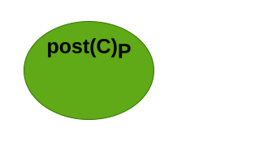
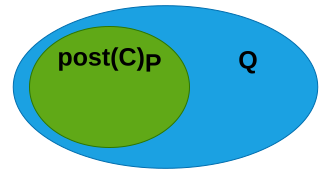
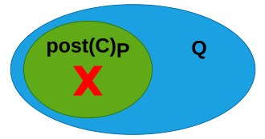
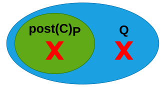
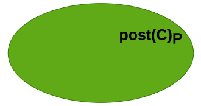
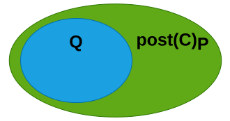
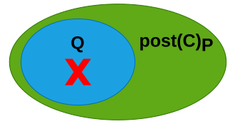
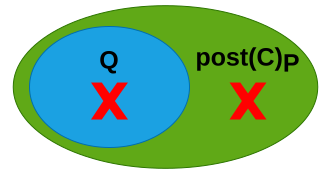

### **Program Logics for   Proving (In)Correctness of    Real World Programs**

 

**Pedro Carrott**

PhD Student @ *Imperial College London*

 Press the `S` key to view the speaker notes 

 

Hello, everyone! My name is Pedro Carrott and I'm a PhD student at Imperial College in London. Just like you, I also attended this PL course back in 2021 and I ended up doing my MSc thesis with João where I formally verified a concurrent data structure in Coq. However, I won't be talking about that today. Instead, I'll be expanding a bit on what you learned throughout this term about Hoare Logic and I'll introduce you to other kinds of reasoning that you can apply to programs via program logics. The main purpose of this talk is to show how broadly the concepts you have learned span across potential applications, but also to give you an idea as to how all of this can be used in practice to reason about real world software.

 

---

<section>

## Hoare Logic

 (continue below) 

 

So, I'll start with a recap on Hoare Logic to make sure that we're all on the same page.

 

---

### Hoare Triples

  
  
  The behaviour of a program C is described by a precondition P and postcondition Q.
  
  

  
  The postcondition can be relaxed using the consequence rule.
  

 

  
  $\\{ P \\} \ C \ \\{ Q \\} \iff \textsf{post}(C)_{P} \subseteq Q$
  

  
  $\left\\{ \begin{array}{c} x = 41 \\\\ \\\\ \\ \end{array} \right\\} \quad x := x + 1 \quad \left\\{ \begin{array}{c} x = 42 \\\\ \\\\ \\ \end{array} \right\\}$
  

  
  $\left\\{ \begin{array}{c} x = 41 \\\\ \\\\ \\ \end{array} \right\\} \quad x := x + 1 \quad \left\\{ \begin{array}{c} x = 42 \\\\ \lor \\\\ x = 41 \end{array} \right\\}$
  

  
  $\left\\{ \begin{array}{c} x = 41 \\\\ \\\\ \\ \end{array} \right\\} \quad x := x + 1 \quad \left\\{ \begin{array}{c} x = 42 \\\\ \lor \\\\ \textcolor{red}{\textsf{err}} \end{array} \right\\}$
  

 

In Hoare Logic we describe the behaviour of a program using a Hoare triple.

The initial state of a program C is described through an assertion P called the triple's precondition, while an assertion Q called the triple's postcondition describes how that initial state is altered after the program terminates, if it terminates. More formally, we can define the meaning of a Hoare triple as "For every state that satisfies the precondition, executing the program will lead to some state satisfying the postcondition"

As an example, this triple accurately describes the behaviour of an increment on a variable x when x is initially set to 41.

We could also apply the rule of consequence to generalize the postcondition to something like this. This triple is less precise but it is still a correct triple, since only one of the disjuncts needs to be true.

You could even naively attempt to encode error handling in your logic by showing this other triple, which is also valid due to the same reason.

 

---

### Over-approximation

  
  
  The postcondition Q *over-approximates* the exact set of reachable states from P.
  
  

  
  Errors expressed in Q may not be reachable, which may lead to undesired *false positives*.
  

  
  
  

  
  
  

  
  
  

  
  
  

 

Unfortunately, this naive attempt at handling errors is not particularly useful and here's why.

Let's consider the green region to be the exact set of states reachable by a program C, given a precondition P. As you've seen in the previous example, due to the consequence rule, you can always relax your postcondition and make it more general.

In other words, the postcondition Q doesn't describe the exact set of final states, but rather an over-approximation of them. If the over-approximation is tight enough and only describes ok states, then we can be assured that any subset of Q will also only contain ok states. However, if the postcondition also describes error states, we have no way of knowing if the error states...

... belong to set of reachable states...

... or if they only appear in the gap obtained by the over-approximation. In other words, using Hoare Logic for bug detection is prone to result in the advertisement of false alarms or false positives, which could be detrimental for the adoption of bug detection tools that rely on this kind of reasoning.

 

</section>

---

<section>

## Incorrectness Logic

 (continue below) 

 

This issue motivated a fragment of the PL community to investigate alternative approaches for incorrectness reasoning that could guarantee the absence of false positives. The most successful and arguagly the simplest approach so far has been Incorrectness Logic, which can be understood as a dual to Hoare Logic.

 

---

### Under-approximation

  
  
  The postcondition Q *under-approximates* the exact set of reachable states from P.
  
  

  
  Errors expressed in Q are always reachable, excluding the possibility of *false positives*.
  

  
  
  

  
  
  

  
  
  

  
  
  

 

The main idea behind Incorrectness Logic...

... is to have the postconditions describe...

... an under-approximation of the set of reachable states.

In that way, if we manage to prove that an error is reachable in that under-approximation, then it is certainly reachable by the program and we have managed to prove the existence of a bug.

This approach may lead to missing out on bugs that appear in the gap, but this is usually considered a reasonable tradeoff to make, since the over-approximation doesn't guarantee the presence of any bugs to begin with.

 

---

### Incorrectness Triples

  
  The subset relation is reversed for incorrectness triples.
  

  
  Postconditions can only be tightened, only preconditions can be relaxed.
  

  
  This valid Hoare triple is not a valid IL triple because $x = 41$ is not reachable.
  

  
  This is a valid IL triple because $x = 42$ is reachable from the state where $x = 41$.
  

 

  
  
  $[ P ] \ C \ [ Q ] \iff \textsf{post}(C)_{P} \supseteq Q$
  
  

  
  $\left\\{ \begin{array}{c} x = 41 \\\\ \\\\ \\ \end{array} \right\\} \quad x := x + 1 \quad \left\\{ \begin{array}{c} x = 42 \\\\ \lor \\\\ x = 41 \end{array} \right\\}$
  

  
  $\left[ \begin{array}{c} x = 41 \\\\ \lor \\\\ x = 42 \end{array} \right] \quad x := x + 1 \quad \left[ \begin{array}{c} x = 42 \\\\ \\\\ \\ \end{array} \right]$
  

 

Formally, an incorrectness triple can be defined...

... by simply reversing the definition of Hoare triples: "Every state that satisfies the postcondition is reachable by executing the program from some initial state satisfying the precondition".

The consequence rule is also reversed, meaning that we can only tighten the postcondition, not relax it. Conversely, the precondition can be relaxed in incorrectness triples, while these can only be tightened in Hoare triples.

For example, while this is a valid Hoare triple, it is not a valid incorrectness triple, because a state where x=41 is not reachable by the program.

On the other hand, this triple is valid under incorrectness logic, because a state where x=42 is reachable by some state in the precondition. Even though it is not reachable from the state where x is already 42, it is reachable from the state where x is 41. This is in contrast with Hoare Logic, where you have to verify the reachability of every initial state in the precondition.

 

---

### Proof Rules

  
  A new command in the programming language for raising explicit errors.
  

  
  The sequencing rule allows shortcircuiting the program.
  

  
  The standard sequencing rule is still applicable for ok traces of $C_1$.
  

 

  
  $[ P ] \ \textsf{error} \ [ \textcolor{red}{\textsf{err} :} P ]$
  

  
  $[ P ] \ C_1 \ [ \textcolor{red}{\textsf{err} :} Q ]$
  

  $[ P ] \ C_1; C_2 \ [ \textcolor{red}{\textsf{err} :} Q ]$
  

  
  $[ P ] \ C_1 \ [ \textcolor{green}{\textsf{ok} :} R ] \quad [ R ] \ C_2 \ [ \epsilon : Q ]$
  

  $[ P ] \ C_1; C_2 \ [ \epsilon : Q ]$
  

 

You also have new proof rules...

... such as the rule for explicit errors in the language. It will always result in a error and will not alter the state of the program.

There is also a new sequencing rule that allows you to shortcircuit the program if the first command crashes with an error.

The normal sequencing rule still exists, as long as C1 executes to an ok state. This means that we can avoid reasoning about C2 if we wish to report any errors as soon as possible, but we can also analyze the program traces where C1 is successful and we're interested in finding more bugs that may appear in C2.

 

---

### Comparison between HL and IL


Absence of bugs vs Presence of bugs


 

Under-approximation for [non-termination](https://www.soundandcomplete.org/papers/Unter.pdf)

 
 

Combining both:

 

[Outcome Logic](https://doi.org/10.1145/3586045)


, [Hyper Hoare Logic](https://arxiv.org/abs/2301.10037)


 

So, I think this constrasts with what you have learned during this term, because I'm sure you've mostly focused on reasoning about and proving the correctness of programs, which amounts to proving the absence of bugs.

But I hope you find it interesting to see how you can apply similar reasoning principles to reason about the presence of bugs instead.

There are a number of other properties, such as non-termination that can be reasoned about using under-approximate techniques.

Some works have also attempted to combine both kinds of reasoning in the same logic:

- Outcome Logic separates the notions of under-approximation and reachability, extending Hoare Logic with what they called an outcome conjuntion. This allows them to incorporate under-approximation within their over-approximate logic and can even prove a class of errors that are not provable in IL. Namely, OL can be used to prove that no ok state is reachable by the program, while in IL you necessarily need to prove the reachability of some bad state.

- Hyper Hoare Logic can be used to prove and disprove triples about hyper-properties of a program. A hyper-property is a program property that relates different executions of the same program. For example, determinism is a hyper-property which states that all executions of a program will always exhibit the same behaviour and result.

 

</section>

---

<section>

## Separation Logic

 (continue below) 

 

Now, for the second part of this talk, I will shift the focus from correctness vs incorrectness to reasoning about such properties on more complex programs than the ones you are used to reasoning about. Namely, I'll try to give you an overview of Separation Logic, which is particularly useful for reasoning about C-style programs where you handle raw pointers and explicit memory allocation.

 

---

### Heap and Ownership

  
  The *points-to* assertion asserts ownership of heap location $l$.
  

  
  
  The *separating conjunction* $*$ denotes ownership of disjoint heap addresses.
  
  

  
  Unlike the standard conjunction $\land$, $*$ is not idempotent.
  

 

  
  $ l \mapsto v $
  

  
  $ l_1 \mapsto v_1 * l_2 \mapsto v_2 \quad \vdash \quad l_1 \neq l_2 $
  

  
  $ l \mapsto v_1 * l \mapsto v_2 \quad \vdash \quad \textsf{False} $
  


$P \land P \quad \vdash \quad P$


 

So far, the programs you've reasoned about are programs that only track a variable store. However, real world programs might also require tracking the heap for the program state.

In Separation Logic, ownership of individual heap locations is expressed through the points-to assertion where location l on the heap contains some value v.

Separation Logic also introduces the separating conjunction, which reads similarly to the standard conjunction but provides a much stronger guarantee. Namely, the separating conjuntion enforces both sides to refer to separate parts of the heap, so we can be sure that l1 and l2 are different memory addresses.

More specifically, the following must never hold because l is not separate from itself.

This is in contrast with the standard conjunction where P /\ P necessarily implies P.

 

---

### Arrays

  
  
  Arrays are merely the separating conjunction over all addresses within the array bound.
  
  

  
  
  The *magic wand* is the analogue of implication in Propositional Logic.
  
  

  
  We can assert ownership of an individual array entry...
  

  
  ... and abstract the remaining entries as the array resource "minus" the owned entry.
  

 

  

  
  
  $\textsf{Array}(a, vs)$
  
  
  
  
  $\triangleq \mathop{\Huge\ast}\limits_{i = 0}^{|vs| - 1}$
  
  
  
  
  $(a + i) \mapsto vs[i]$
  
  
  

  
  
  $ P * (P -\\!\\!\\!\\!\\!\\;\ast Q) \vdash Q$
  
  

  

  
  $l \mapsto v$
  
  
  $ \quad * \quad \left(l \mapsto v -\\!\\!\\!\\!\\!\\;\ast \textsf{Array}(a, vs)\right)$
  
  


$P \land (P \Rightarrow Q) \vdash Q$


 

You can even define...

... an array in heap location a with values vs of length n...

... using a big star operator that iterates over all indexes of the array...

... and asserts ownership over each memory address of offset i, which should map to the ith value of vs.

You can also use the separating implication to hide implementation details. This connective is commonly referred to as the magic wand and...

... follows the SL analogue of modus ponens of propositional logic.

We can then assert ownership of an individual entry...

... and ownership of the parts of the array minus that same entry. This way we can avoid enumerating all the remaining array entries explicitly.

 

---

### The Frame Rule

  
  An important result from SL is the *frame rule*.
  

  
  A frame $R$ not modified by the program is not need to prove the triple.
  

  
  This rule enables compositionality in SL.
  

 

  
  $\\{ P \\} \ C \ \\{ Q \\} \quad \textsf{mod}(C) \cap \textsf{fv}(R) = \emptyset$
  

  $\{ P * R \} \ C \ \{ Q * R \}$
  

 

A result from separation logic that reflects the importance of this notion of separation is...

... the frame rule.

In essence, if we have some resources R that are not modified by the program C, we can remove them from our pre and postconditions and simply prove the triple for P and Q. This R is commonly referred to as a frame and, if you consider the previous array example, it means that we can frame away the implication resources and focus only on what program C does to the specific entry.

This modularity provided by the frame rule is what has made SL so successful by enabling scalability in the verification of large codebases.

 

---

### Modular Specifications

  
  Consider the specification for a function that increments the value in a heap location $l$.
  

  
  The triple can be reused in any context extended with a frame $R$.
  

 

  
  $\\{ l \mapsto v \\} \quad \textsf{inc}(l) \quad \\{ l \mapsto v+1 \\}$
  

  
  $\\{R * l \mapsto v \\} \quad \textsf{inc}(l) \quad \\{ l \mapsto v+1 * R \\}$
  

 

  
  $R \triangleq \textsf{emp}$
  

  
  $R \triangleq l \mapsto v -\\!\\!\\!\\!\\!\\;\ast \textsf{Array}(a, vs)$
  

 

For example, your program C might be a function call which is being called over all entries of the array.

Suppose the function only increments the value in the memory location passed as argument. The ideal specification for such a function, would something similar to this triple. The neat thing about this specification is that it only mentions the resources that are actually used inside the function, without mentioning anything about the specific context where it is called.

The frame rule allows us to reuse this specification regardless of whatever context R we have.

R could be empty if we were just handling a single memory location or ...

... R could be the remaining entries of the array.

 

---

### Incorrectness Separation Logic

  
  Incorrectness triples can also be defined in SL.
  

  
  In ISL, we can specify double-free errors...
  

  
  ... as well as use-after-free...
  

  
  ... and uninitialized value errors.
  

 

  
  
  $[ l \mapsto v ] \quad \textsf{free}(l) \quad [ \textcolor{green}{\textsf{ok} :} l \not\mapsto]$
  
  

  
  $[ l \not\mapsto ] \quad {^*l} \quad [ \textcolor{red}{\textsf{err} :} l \not\mapsto]$
  

  
  
  $[ l \not\mapsto ] \quad \textsf{free}(l) \quad [ \textcolor{red}{\textsf{err} :} l \not\mapsto]$
  
  

  
  $[ l \mapsto_? ] \quad {^*l} \quad [ \textcolor{red}{\textsf{err} :} l \mapsto_?]$
  

 

The previous incorrectness judgements can also be applied to reasoning about memory locations.

For example, the spec for free yields a deallocated points-to assertion.

An error spec can also be defined to express a double-free error...

.. and you can also describe erroneous reads from freed...

...and uninitialized locations.

 

---

### Applications


Concurrency: <u style="color:green">[Iris](https://iris-project.org/)/[TaDA](https://doi.org/10.1007/978-3-662-44202-9_9)</u> and <u style="color:red">[CISL](https://doi.org/10.1145/3498695)/[CASL](https://doi.org/10.4230/LIPIcs.CONCUR.2023.25)</u>


 

Correctness + Incorrectness:

 

[Outcome SL](https://doi.org/10.1145/3649821)


, [Exact SL](https://doi.org/10.4230/LIPIcs.ECOOP.2023.19)

 
 

ISL is the basis of [Pulse](https://doi.org/10.1145/3527325), a module of the [Infer](https://fbinfer.com/) program analysis at Meta


 

Separation Logic has also lead to several other works...

... such as reasoning about concurrency in correctness logics like Iris or TaDA and incorrectness logics like CISL and CASL.

Other SL-based logics that have combined both correctness and incorrectness reasoning are:
- Outcome Separation Logic, which extends OL with the key concepts of separation logic
- Exact Separation Logic, which works the exact specifications, rather than over and under approximations

From the pratical side of things, ISL serves as the basis for Pulse, a part of the Infer tool, which is a program analysis for scalable bug detection used at Facebook/Meta. The no-false-positives guarantee provided by the underlying under-approximate logical framework and the compositionality of SL have been the main reasons for the success of Pulse. Hopefully, this might convince you of the applicability of this kind of work to the real world of software development, where scalability is one of the main factors to consider in large software systems.

 

</section>

---

# Thank you!

 

And that's it for me. Currently, I'm trying to apply incorrectness reasoning to Rust types. The main goal is to develop a similar analysis as Pulse, but to Rust code rather than C or Java. Feel free to ask questions or get in touch later on. I'll be happy to discuss any ideas you might have or just recommend papers on any of these topics that might be relevant to you. Thanks for coming to my TED talk.

 