### **Formal Verification of a Concurrent Map in Iris**
#### Resourceful Reasoning beyond Linearization Points for the Lazy JellyFish Skip List

 

<small>**Pedro Carrott** --- *INESC-ID and IST, University of Lisbon*</small>
<small>João Ferreira --- *INESC-ID and IST, University of Lisbon*</small>

 Press the `S` key to view the speaker notes 

 <small>

The work I'll be presenting is based on my Master's thesis, advised by João Ferreira, which has been submitted for publication and is currently under review. It consists on the formal verification of the Lazy JellyFish Skip List, an implementation for concurrent maps with version control.

</small> 

---

<section>

## Introduction

<small> (continue below) </small>

---

### Concurrent Maps and Skip Lists


<small>Concurrent maps are used by data store applications to index data efficiently.</small>



<small>Most data stores record the value history of each key, rather than delete old values.</small>



<small>The skip list is the most widely used map implementation by these applications.</small>



<small>JellyFish extends traditional skip lists with a list of timestamped values per key.</small>


 <small>

Maps provide an abstraction for a collection of key-value pairs. This is a useful abstraction for applications such as data stores, which require efficient structures to index data.

In fact, most of these applications maintain a history of values for each key in the map, so as to record different versions of the same data, instead of deleting outdated information.

The most widely used implementation for such concurrent append-only maps is the skip list data structure.

A state-of-the-art implementation for concurrent append-only skip lists is JellyFish, which extends traditional skip lists by storing a linked list in each node to reflect the history of values associated with its key.

</small> 

---

### Iris and Logical Atomicity


<small>We verify a variant of JellyFish using the concurrent separation logic [Iris](https://iris-project.org/).</small>



<small>Our proofs show operations on JellyFish to be logically atomic.</small>



<small>We extend atomic triples to reason about resources *after* a linearization point.</small>



<small>From the logically atomic specification, we build a suitable client specification.</small>



<small>The Coq formalization is [publicly available](https://github.com/sr-lab/iris-jellyfish).</small>


 <small>

In this work, we verify the functional correctness of a lock-based variant of JellyFish using Iris, a state-of-the-art concurrent separation logic.

As a standard correctness criterion for concurrent operations, we prove operations on JellyFish to be logically atomic.

For this purpose, we extend the Iris definition of atomic triples to be able to reason about shared resources after the operation's linearization point.

We then show how to build from the logically atomic specification other specifications more suitable for client reasoning.

All our results are mechanized in Coq and available on GitHub.

</small> 

</section>

---

<section>

## Skip Lists

<small> (continue below) </small>

 <small>

We begin by looking at the implementation of the lazy JellyFish skip list.

</small> 

---

### Overview

  
  <small>A skip list contains two sentinel nodes with keys $\textsf{MIN}$ and $\textsf{MAX}$, linked in $\textsf{HMAX}$ lists.</small>
  

  
  <small>Each list is a sublist of its lower level and all lists are sorted by key.</small>
  

  
  <small>Elements can be skipped by searching the lists in the higher levels.</small>
  

  
  
  

  
  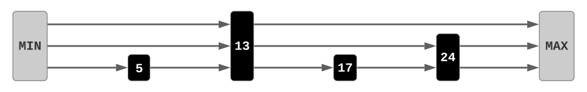
  

  
  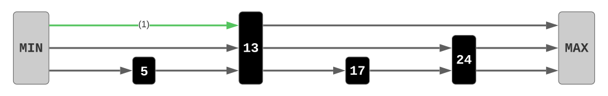
  

  
  
  

  
  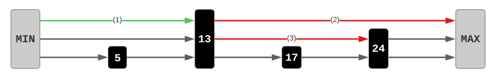
  

  
  
  

 <small>

The skip list is initialized with two sentinel nodes with keys MIN and MAX, defining the valid key range for the structure. The left sentinel contains an array of HMAX entries, each pointing to the right sentinel, initializing HMAX empty linked lists.

As new keys are inserted to the skip list, each list must always remain a sublist of the list directly below it, while the bottom list should contain all keys which have been inserted.

Since each level contains progressively fewer elements of the bottom list, maintaining all lists sorted allows searches in higher levels to skip elements that would otherwise be traversed in a standard linear search. We search in the top level ...

... stop searching when we reach a value equal to or greater than the key ...

... descend to the next level starting from the same element and repeat until we reach the bottom level.

If the key is not found upon reaching the bottom level, then we can conclude that it does not belong to the skip list.

</small> 

---

### JellyFish

  
  <small>The JellyFish skip list implements a map, storing key-value pairs.</small>
  

  
  <small>Each node contains a <i>vertical list</i>, a timeline with timestamped values.</small>
  

  
  <small>To append a new value, the timestamp must be <i>at least as recent</i> as the head's.</small>
  





 <small>

Skip lists can also be used to implement key-value stores.

The JellyFish design keeps in each node a list of timestamped values, referred to as a vertical list, representing the timeline of values associated with the key.

The timeline retains its consistency by never appending new values to a vertical list if the new timestamp is less recent than the timestamp found at the head.

</small> 

---

### Concurrent Updates

  
  <small>Updating threads employ lazy synchronization through locks.</small>
  

  
  <small>Traversal is done until the bottom, locking the key's predecessor.</small>
  

  
  <small>The key does not exist: a new node is linked to a random number of levels.</small>
  

  
  <small>The lock is released after insertion, locking the predecessor in the next level.</small>
  

  
  <small>Insertions are done bottom-up to maintain the sublist relation.</small>
  

  
  <small>Updates follow the same initial steps, locking the key's predecessor in the bottom level.</small>
  

  
  <small>A node already exists for the key: the new value will be appended to the vertical list.</small>
  

  
  
  

  
  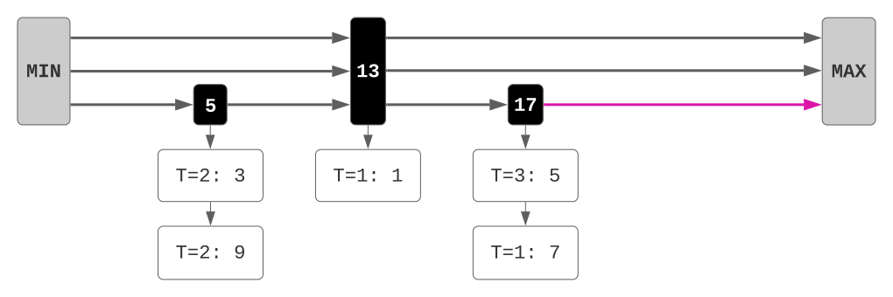
  

  
  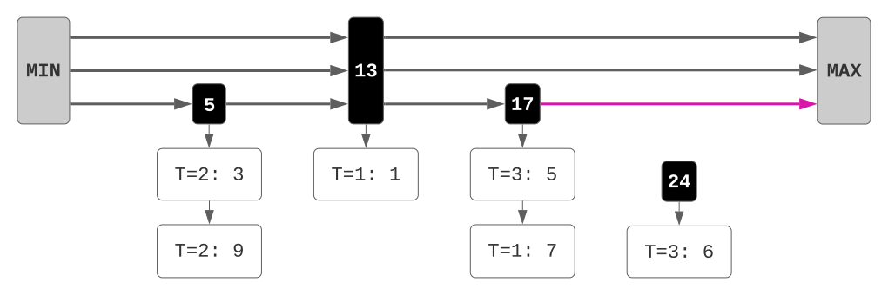
  

  
  
  

  
  
  

  
  
  

  
  
  

 <small>

To ensure that concurrent updates to the data structure alter the state safely, the put operation employs a lazy synchronization strategy using locks. A thread trying to insert key 24 will first traverse the skip list until the bottom level to find its predecessor in key 17 and then ... 

... acquires the node's lock in the bottom level. Since the key has not been found, ...

... a new node is created with some random height. As the predecessor's lock has been acquired, ...

... we can replace its successor by linking the new node to the bottom level. The lock can then be released and the node can be inserted in the upper level.

Insertions are performed bottom-up so as to ensure that the sublist relation is preserved.

A following update on key 24 will repeat the same initial steps by traversing the skip list until the bottom level and locking its predecessor.

As the node already exists it will append a new value to its vertical list, as long as the timestamp is as recent as 3.

</small> 

</section>

---

<section>

## Logical Atomicity

<small> (continue below) </small>

 <small>

To reason about the correctness of JellyFish, I'll now discuss the notion of logical atomicity.

</small> 

---

### Linearization Point


<small>A non-atomic operation is logically atomic if a single atomic step yields its effects.</small>



<small>Therefore, we can reason about the operation *as if* it were atomic.</small>



<small>We refer to that step as the *linearization point* (LP) of the operation.</small>



<small>The LP of an insertion in JellyFish is the LP of an insertion in the bottom level.</small>


 <small>

An operation is said to be logically atomic if it contains a single atomic step which is responsible for the desired effects for the operation.

When reasoning about the possible interleavings between steps of concurrent executions, we can simply reason about the interleavings between the corresponding atomic step of each operation as if these operations were atomic.

This atomic step is commonly known as the operation's linearization point.

In the case of JellyFish, the linearization point of put corresponds to the linearization point of the bottom level insertion, meaning that insertions on the upper levels take place after the linearization point.

</small> 

---

### Atomic Triples

  
  <small>Atomic triples describe the effects of an operation at its LP.</small>
  

  
  <small>The precondition describes the invariant shared state *before* the LP.</small>
  

  
  <small>The postcondition states how the shared state is affected *at* the LP.</small>
  

  
  <small>Atomic triples do not describe the invariant state *after* the LP.</small>
  

  
  <small>Therefore, we cannot reason about upper level insertions in JellyFish.</small>
  

  
  $ \left\langle \ \alpha \ \right\rangle $
  $ \ e \ $
  $ \left\langle \ \beta \ \right\rangle $
  

  
  $ \left\langle \ \textcolor{red}{\alpha} \ \right\rangle $
  $ \ e \ $
  $ \left\langle \ \beta \ \right\rangle $
  

  
  $ \left\langle \ \alpha \ \right\rangle $
  $ \ e \ $
  $ \left\langle \ \textcolor{red}{\beta} \ \right\rangle $
  

  
  $ \left\langle \ \alpha \ \right\rangle $
  $ \ e \ $
  $ \left\langle \ \beta \ \right\rangle $
  

 <small>

The desired behaviour for a logically atomic operation can be expressed through atomic triples.

The precondition states an invariant assertion on the shared state which must hold throughout all steps prior to the linearization point.

The postcondition expresses how that shared state is altered at the linearization point.

After the linearization point, no assertion is provided losing all information regarding the shared state.

In other words, after inserting a node in the bottom level of JellyFish, we lose access to the entire data structure, so we cannot verify insertions in the remaining levels.

</small> 

---

### Nested Data Structures

  
  <small>Nested data structures are data structures composed of other data structures.</small>
  

  
  <small>Generally, locks are acquired *before* and released *after* the LP.</small>
  

  
  <small>An atomic triple should describe the state of the shared object in its precondition.</small>
  

  
  <small>Therefore, we can access the shared object before the LP.</small>
  

  
  <small>We can thus acquire the lock contained within the shared object. </small>
  

  
  <small>At the LP, we can perform the atomic effects on the shared object.</small>
  

  
  <small>After the LP, we do not know how to describe the invariant shared state, ...</small>
  

  
  <small>... so we can no longer access the shared object nor its lock.</small>
  

  
  <small>Without access to the lock, we are unable to release it.</small>
  

  
  <small>We can reason about the lock and the object as separately shared structures, ...</small>
  

  
  <small>... resulting in a more complex specification.</small>
  

  
  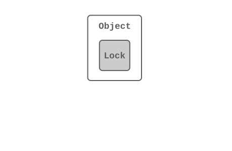
  

  
  
  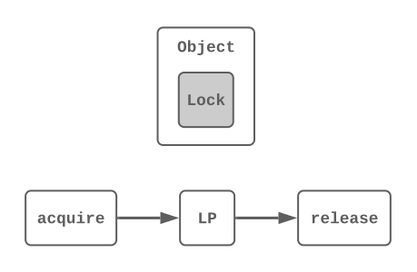
  
  

  
  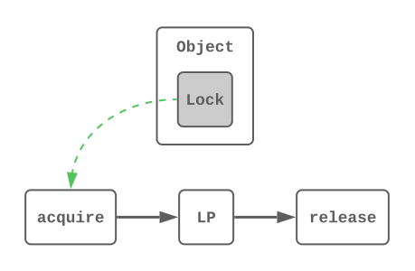
  

  
  
  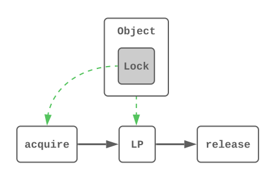
  
  

  
  
  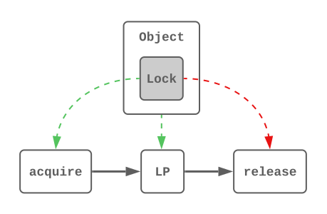
  
  

  
  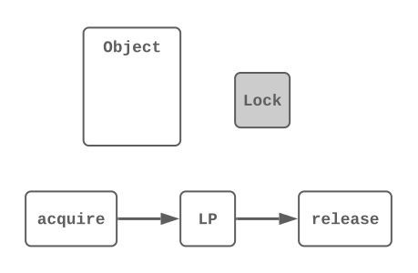
  

 <small>

In general, this problem arises with any data structure composed of other simpler data structures, such as any shared object containing a lock.

The standard use case for locks is to ensure mutual exclusion by acquiring the lock before reaching the linearization point, releasing it afterwards.

The atomic triple for such operations should assert ownership of the shared object in its precondition ...

... allowing the object to be accessed before the linearization point.

As the lock is a part of the object, we are thus able to acquire the lock ...

... before reaching the linearization point.

After the linearization point, however ...

... we lose access to the object ...

... and so we cannot release the lock.

An alternative approach would be to treat the object and the lock as separately shared resources ...

... but this would only result in a more complex and less intuitive specification.

</small> 

---

### Beyond Linearization Points

  
  <small>To reason beyond LPs, we provide an alternative definition of atomic triples.</small>
  

  
  <small>In this definition, the invariant shared state must hold throughout *all* steps.</small>
  

  
  <small>These triples still describe the effects at the LP.</small>
  

  
  <small>We also include *private* pre and postconditions to describe *thread-local* resources.</small>
  

  
  <small>The previous notation is still used when there are no local resources.</small>
  

  
  $ \left\langle \ \alpha \rightarrow \beta \ \right\rangle $
  $ \left\\{ \ P \ \right\\} $
  $ \ e \ $
  $ \left\\{ \ Q \ \right\\} $
  

  
  $ \left\langle \ \textcolor{red}{\alpha} \rightarrow \beta \ \right\rangle $
  $ \left\\{ \ P \ \right\\} $
  $ \ e \ $
  $ \left\\{ \ Q \ \right\\} $
  

  
  $ \left\langle \ \alpha \rightarrow \textcolor{red}{\beta} \ \right\rangle $
  $ \left\\{ \ P \ \right\\} $
  $ \ e \ $
  $ \left\\{ \ Q \ \right\\} $
  

  
  $ \left\langle \ \alpha \rightarrow \beta \ \right\rangle $
  $ \left\\{ \ \textcolor{red}{P} \ \right\\} $
  $ \ e \ $
  $ \left\\{ \ \textcolor{red}{Q} \ \right\\} $
  

  
  $ \left\langle \ \alpha \ \right\rangle $
  $ \ e \ $
  $ \left\langle \ \beta \ \right\rangle $
  

 <small>

To solve this issue, we redefine the concept of logical atomicity.

The invariant assertion on the shared state must now hold throughout all steps of the operation ...

... while the effects are still described in the same manner.

Akin to standard Hoare triples, we also include private pre and postconditions to reason about thread-local resources.

Whenever atomic triples require no local resources, we still use the previous notation.

</small> 

</section>

---

<section>

## A Map Specification

<small> (continue below) </small>

 <small>

I now present the atomic triples which express the intended behaviour for JellyFish.

</small> 

---

### Representation Predicate

  
  <small>We first define a representation predicate for the map resources.</small>
  

  
  <small>The left sentinel pointer keeps track of the physical structure.</small>
  

  
  <small>A map describes the abstract state of the structure.</small>
  

  
  $ \textsf{VCMap}(p, m, \Gamma) $
  

  
  $ \textsf{VCMap}(\textcolor{red}{p}, m, \Gamma) $
  

  
  $ \textsf{VCMap}(p, \textcolor{red}{m}, \Gamma) $
  

 <small>

First, we require a representation predicate to describe the known state of the map, called VCMap.

VCMap is parameterized by the pointer to the left sentinel, which tracks the physical state, ...

... and a map which abstracts our interpretation of the state of the data structure.

</small> 

---

### Triple for Constructor

  
  <small>A Hoare triple is defined for $\textsf{newMap}$, rather than an atomic triple.</small>
  

  
  <small>No resources are needed as a precondition ...</small>
  

  
  <small>... and we obtain a pointer to an empty map.</small>
  

  
  $ \left\\{ \ \textsf{emp} \ \right\\} \\\\ $
  

  
  $ \textsf{newMap} \\\\ $
  

  
  $ \left\\{ \ \exists \ p, \ \Gamma. \ \textsf{VCMap}(p, \varnothing, \Gamma); \ p \ \right\\} $
  

 <small>

For the skip list constructor, we define a Hoare triple instead of an atomic triple, since it will never be called concurrently for the same object.

This method does not need any initial resources as a precondition ...

... and the postcondition simply asserts exclusive ownership of an empty map, where the return value p corresponds to the left sentinel pointer.

</small> 

---

### Triple for Lookups

  
  <small>$\textsf{get}$ performs a search for a key.</small>
  

  
  <small>The invariant ties the shared resources to some abstract state $m$.</small>
  

  
  <small>The map remains unchanged after the search.</small>
  

  
  <small>The result is empty if the key is not in the map.</small>
  

  
  <small>Otherwise, the most recent value is returned, ignoring the vertical list.</small>
  

  
  $ \left\langle \ m. \ \textsf{VCMap}(p, m, \Gamma) \ \right\rangle \\\\ $
  

  
  $ \textsf{get} \ p \ k \\\\ $
  

  
  $ \left\langle \ \textcolor{red}{\textsf{VCMap}(p, m, \Gamma)}; \begin{array}{c} \textsf{\textbf{match}} \ m[k] \ \textsf{\textbf{with}} \ \textsf{None} \Rightarrow \textsf{None} \ | \ \textsf{Some}(v, t, vl) \Rightarrow \textsf{Some}(v, t) \end{array} \right\rangle $
  

  
  $ \left\langle \ \textsf{VCMap}(p, m, \Gamma); \begin{array}{c} \textsf{\textbf{match}} \ \textcolor{red}{m[k]} \ \textsf{\textbf{with}} \ \textcolor{red}{\textsf{None}} \Rightarrow \textcolor{blue}{\textsf{None}} \ | \ \textsf{Some}(v, t, vl) \Rightarrow \textsf{Some}(v, t) \end{array} \right\rangle $
  

  
  $ \left\langle \ \textsf{VCMap}(p, m, \Gamma); \begin{array}{c} \textsf{\textbf{match}} \ \textcolor{red}{m[k]} \ \textsf{\textbf{with}} \ \textsf{None} \Rightarrow \textsf{None} \ | \ \textcolor{red}{\textsf{Some}(v, t, vl)} \Rightarrow \textcolor{blue}{\textsf{Some}(v, t)} \end{array} \right\rangle $
  

 <small>

The get method performs a lookup for the current value of some key.

The invariant asserts shared ownership of a VCMap resource tied to some abstract state.

At the linearization point, this resource is preserved as is, since a search is not supposed to perform any changes.

If the key does not exist in the map, then the search must come up empty.

Otherwise, the value with the most recent timestamp should be returned, ignoring the vertical list.

</small> 

---

### Triple for Updates

  
  <small>$\textsf{put}$ receives a key, value and timestamp.</small>
  

  
  <small>Again, the invariant ties the shared resources to some abstract state $m$.</small>
  

  
  <small>At the LP, the map is updated depending on the values it stores.</small>
  

  
  $ \left\langle \ m. \ \textsf{VCMap}(p, m, \Gamma) \ \right\rangle \\\\ $
  

  
  $ \textsf{put} \ p \ k \ v \ t \\\\ $
  

  
  $ \left\langle \ \textsf{VCMap}(p, \textsf{CaseMap}(m, k, v, t), \Gamma) \ \right\rangle \\\\ $
  

 <small>

Finally, the put method is parameterized by the updated key, as well as its new value and timestamp.

We use the same invariant as the one for get.

Whether the abstract state of the map is updated will be determined by the state of the map at the linearization point.

</small> 

---

### Map Updates

  
  <small>A case analysis is performed on the map's entry for the key.</small>
  

  
  <small>If the entry is empty, then the key is added to the map with the given value.</small>
  

  
  <small>Otherwise, an update to the entry will occur depending on the timestamp.</small>
  

  
  <small>If the given timestamp is *less recent*, then the map will remain unchanged.</small>
  

  
  <small>Otherwise, the old value is appended to the vertical list, keeping the new value.</small>
  

  
  $ \begin{array}{rl} \textsf{CaseMap}(m, k, v, t) \triangleq & \textsf{\textbf{match}} \ m[k] \ \textsf{\textbf{with}} \\\\ & | \ \textsf{None} \Rightarrow \langle k : (v, t, []) \rangle m \\\\ & | \ \textsf{Some}(v_i, t_i, vl) \Rightarrow \textsf{\textbf{if}} \ t < t_i \ \textsf{\textbf{then}} \ m \ \textsf{\textbf{else}} \ \langle k : (v, t, (v_i, t_i) :: vl) \rangle m \end{array}$
  

  
  $ \begin{array}{rl} \textsf{CaseMap}(m, k, v, t) \triangleq & \textsf{\textbf{match}} \ \textcolor{red}{m[k]} \ \textsf{\textbf{with}} \\\\ & | \ \textcolor{red}{\textsf{None}} \Rightarrow \textcolor{blue}{\langle k : (v, t, []) \rangle m} \\\\ & | \ \textsf{Some}(v_i, t_i, vl) \Rightarrow \textsf{\textbf{if}} \ t < t_i \ \textsf{\textbf{then}} \ m \ \textsf{\textbf{else}} \ \langle k : (v, t, (v_i, t_i) :: vl) \rangle m \end{array}$
  

  
  $ \begin{array}{rl} \textsf{CaseMap}(m, k, v, t) \triangleq & \textsf{\textbf{match}} \ \textcolor{red}{m[k]} \ \textsf{\textbf{with}} \\\\ & | \ \textsf{None} \Rightarrow \langle k : (v, t, []) \rangle m \\\\ & | \ \textcolor{red}{\textsf{Some}(v_i, t_i, vl)} \Rightarrow \textsf{\textbf{if}} \ \textcolor{green}{t < t_i} \ \textsf{\textbf{then}} \ m \ \textsf{\textbf{else}} \ \langle k : (v, t, (v_i, t_i) :: vl) \rangle m \end{array}$
  

  
  $ \begin{array}{rl} \textsf{CaseMap}(m, k, v, t) \triangleq & \textsf{\textbf{match}} \ m[k] \ \textsf{\textbf{with}} \\\\ & | \ \textsf{None} \Rightarrow \langle k : (v, t, []) \rangle m \\\\ & | \ \textsf{Some}(v_i, t_i, vl) \Rightarrow \textsf{\textbf{if}} \ \textcolor{green}{t < t_i} \ \textsf{\textbf{then}} \ \textcolor{blue}{m} \ \textsf{\textbf{else}} \ \langle k : (v, t, (v_i, t_i) :: vl) \rangle m \end{array}$
  

  
  $ \begin{array}{rl} \textsf{CaseMap}(m, k, v, t) \triangleq & \textsf{\textbf{match}} \ m[k] \ \textsf{\textbf{with}} \\\\ & | \ \textsf{None} \Rightarrow \langle k : (v, t, []) \rangle m \\\\ & | \ \textsf{Some}(v_i, t_i, vl) \Rightarrow \textsf{\textbf{if}} \ \textcolor{green}{t < t_i} \ \textsf{\textbf{then}} \ m \ \textsf{\textbf{else}} \ \textcolor{blue}{\langle k : (v, t, (v_i, t_i) :: vl) \rangle m} \end{array}$
  

 <small>

The new map abstraction will depend on the map's entry for the key.

If the key is not in the map, then a new entry with a single timestamped value and an initially empty vertical list is added to the map.

If an entry already exists for the key, then an update may occur, depending on the most recent timestamp.

If the new timestamp is less recent, then the new value is outdated and the map will be maintained as is.

Otherwise, the most recent value is appended to the vertical list and the new value and timestamp are added to the map's entry.

</small> 

</section>

---

<section>

## Client Reasoning

<small> (continue below) </small>

 <small>

Although logical atomicity ensures that operations on JellyFish are correct, it does not provide a way to directly reason about functional properties relevant for client programs. I'll now discuss how to reason about shared resources and how to combine thread-local operations to obtain a global view of the shared state.

</small> 

---

### Shared Resources

  
  <small>Shared resources are expressed in Iris through invariants.</small>
  

  
  <small>Invariant resources can be accessed during logically atomic operations.</small>
  

  
  <small>The invariant containing $\textsf{VCMap}$ is abstracted by another predicate.</small>
  

  
  <small>The shared state must not be described by a specific abstract map.</small>
  

  
  
  
  $ I $
  $ \ \mathcal{N} $
  
  

  
  $ \textsf{IsMap}(p, \Gamma) $
  

 <small>

To reason about shared resources, Iris allows the definition of invariants.

Iris invariants ensure that invariant assertions on shared resources do not break by only allowing temporary access to these shared resources during atomic instructions. The same can be done for logically atomic operations as these can be reasoned about as if they were atomic.

A new representation predicate is defined to abstract an Iris invariant protecting a VCMap resource.

This invariant represents the shared state which cannot be tied to a specific map abstraction, unlike VCMap.

</small> 

---

### Private Views

  
  <small>Knowledge of the map's state is obtained through thread-local views of the map.</small>
  

  
  <small>A view refers to a fraction of the map which may be mutable or constant.</small>
  

  
  <small>Views can be split into more views of the *same type* with smaller fractions.</small>
  

  
  <small>Partial views can be combined to obtain the full fraction of the map.</small>
  

  
  <small>Both types of view are interchangeable when in possession of the full fraction.</small>
  

  
  <small>With constant views we can verify clients which perform concurrent reads.</small>
  

  
  <small>Mutable views allow reasoning about concurrent updates to the map.</small>
  

  
  <small>How can we handle conflicting updates and inconsistent views?</small>
  

  
  $ \textsf{MutMap}(m, q, \Gamma) \qquad \qquad \textsf{ConMap}(m, q, \Gamma) $
  

  
  $ \textsf{MutMap}(m, \textcolor{red}{q}, \Gamma) \qquad \qquad \textsf{ConMap}(m, \textcolor{red}{q}, \Gamma) $
  

  
  $ q = q_1 + q_2 $
  

  
  
  $ q = 1 $
  
  

  
  $ \textsf{ConMap}(m, q, \Gamma) $
  

  
  $ \textsf{MutMap}(m, q, \Gamma) $
  

  
  $ \textsf{MutMap}(m_1, q_1, \Gamma) * \textsf{MutMap}(m_2, q_2, \Gamma) $
  

 <small>

The map's state is described by separate views of the map which can be owned privately by each thread.

Each view is associated with a fraction and views can be either mutable or constant.

A view can be split into other views with smaller fractions, maintaining the same type.

All views can be combined to obtain a full fraction, which corresponds to all knowledge we hold of the map's state.

In this scenario, we can switch between types of views, ensuring that we can switch between read-only and write-only concurrency.

With constant views, threads can perform concurrent reads...

... and with mutable views, threads can perform concurrent updates.

However, how can we reason about conflicting updates which may result in inconsistent views of the map?

</small> 

---

### Map Composition

  
  <small>We require a composition operator on maps.</small>
  

  
  <small>For different keys, the combined map will contain both key-value pairs.</small>
  

  
  <small>But what happens when both threads associate different values to the same key?</small>
  

  
  <small>The key will be associated with the composition of both values.</small>
  

  
  <small>Value composition should yield the most recent value.</small>
  

  
  <small>If $i < j$, then the pair with value $a$ is discarded, returning the pair with value $b$.</small>
  

  
  <small>For equal timestamps, both values are possible, depending on the scheduler.</small>
  

  
  <small>As a result, the abstract map associates each key to a *set* of possible values.</small>
  

  
  $ m_1 \cdot m_2 $
  

  
  $ \\{ \ k_1 : x \ \\} \cup \\{ \ k_2 : y \ \\} $
  

  
  $ \\{ \ k : x \ \\} \cup \\{ \ k : y \ \\} $
  

  
  $ \\{ \ k : x \cdot y \ \\} $
  

  
  The $\textsf{argmax}$ operator returns that value.
  

  
  $ \textsf{prodZ}(a, i) \cdot \textsf{prodZ}(b, j) = \textsf{prodZ}(b, j) $
  

  
  $ \textsf{prodZ}(a, i) \cdot \textsf{prodZ}(b, i) = \textsf{prodZ}(a \cup b, i) $
  

 <small>

We reason about such inconsistencies through a composition operator on maps.

If the views hold no key in common, then the combined map is simply a map containing all key-value pairs of both views.

However, when there exists some key in common, the associated value may differ in both views. 

This issue can be resolved by returning a new map entry where the associated value is the composition of both values.

As we've seen previously, a search will always return the most recent value associated with the key. The abstract map should thus associate each key to the value with the greatest timestamp, meaning that value composition should be done through the argmax operator.

Values should be represented as pairs, where timestamp "j" being greater than timestamp "i" returns the pair with value "b", discarding the value "a".

However, when both timestamps are equal, the last value to be written will depend on the scheduler. As such, both "a" and "b" may be the value associated with the key, so ...

... we require "a" and "b" to be sets rather than the actual values. In that way, we can maintain each key associated with all possible values, along with the corresponding timestamp "i".

</small> 

---

### Updates and Lookups

  
  <small>The map is updated by composition with the new timestamped entry for the key.</small>
  

  
  <small>The key is mapped to a singleton set containing the new value.</small>
  

  
  <small>Lookups to the map will depend on the following case analysis.</small>
  

  
  <small>The return result $o$ will be empty if the key is not in the map.</small>
  

  
  <small>Otherwise, some timestamped value is returned.</small>
  

  
  <small>The returned value must belong to some set of values, ...</small>
  

  
  <small>... which corresponds to the set stored in the abstract state of the map.</small>
  

  
  $ \begin{array}{l} m \cdot \\{ \ k : \textsf{prodZ}(\\{ v \\}, t) \ \\} \\\\ \ \\\\ \ \end{array}$
  

  
  $ \begin{array}{l} m \cdot \\{ \ k : \textsf{prodZ}(\textcolor{red}{\\{ v \\}}, t) \ \\} \\\\ \ \\\\ \ \end{array}$
  

  
  $ \begin{array}{l} \textsf{\textbf{match}} \ m[k] \ \textsf{\textbf{with}} \\\\ | \ \textsf{None} \Rightarrow o = \textsf{None} \\\\ | \ \textsf{Some}(a) \Rightarrow \exists \ vs, v, t. \ a = \textsf{prodZ}(vs, t) * v \in vs * o = \textsf{Some}(v, t) \end{array}$
  

  
  $ \begin{array}{l} \textsf{\textbf{match}} \ \textcolor{red}{m[k]} \ \textsf{\textbf{with}} \\\\ | \ \textcolor{red}{\textsf{None}} \Rightarrow \textcolor{blue}{o = \textsf{None}} \\\\ | \ \textsf{Some}(a) \Rightarrow \exists \ vs, v, t. \ a = \textsf{prodZ}(vs, t) * v \in vs * o = \textsf{Some}(v, t) \end{array}$
  

  
  $ \begin{array}{l} \textsf{\textbf{match}} \ \textcolor{red}{m[k]} \ \textsf{\textbf{with}} \\\\ | \ \textsf{None} \Rightarrow o = \textsf{None} \\\\ | \ \textcolor{red}{\textsf{Some}(a)} \Rightarrow \exists \ vs, v, t. \ a = \textsf{prodZ}(vs, t) * v \in vs * \textcolor{blue}{o = \textsf{Some}(v, t)} \end{array}$
  

  
  $ \begin{array}{l} \textsf{\textbf{match}} \ m[k] \ \textsf{\textbf{with}} \\\\ | \ \textsf{None} \Rightarrow o = \textsf{None} \\\\ | \ \textsf{Some}(a) \Rightarrow \exists \ vs, v, t. \ a = \textsf{prodZ}(vs, t) * \textcolor{green}{v \in vs} * o = \textsf{Some}(v, t) \end{array}$
  

  
  $ \begin{array}{l} \textsf{\textbf{match}} \ m[k] \ \textsf{\textbf{with}} \\\\ | \ \textsf{None} \Rightarrow o = \textsf{None} \\\\ | \ \textsf{Some}(a) \Rightarrow \exists \ vs, v, t. \ \textcolor{green}{a = \textsf{prodZ}(vs, t)} * v \in vs * o = \textsf{Some}(v, t) \end{array}$
  

 <small>

Since map composition will handle all conflicts, updates to the map can be expressed through composition with a singleton entry for the key with its new timestamped value ...

... which is initially kept in its own singleton set.

Since we can only ensure that each key is mapped to a set of possible values, lookups can now be defined as follows.

The search will come up empty if there is no map entry for the key.

Otherwise, some timestamped value will be returned ...

... which belongs to the set of values ...

.. stored in the map associated with the same timestamp.

</small> 

</section>

---

<section>

## Conclusion

<small> (continue below) </small>

 <small>

To conclude, this work contributes to the understanding of complex nested data structures, providing a new approach for reasoning about concurrent maps.

</small> 

---

### Contributions


<small><li>The first verification effort for the JellyFish skip list.</li></small>



<small><li>A compositional approach for defining map specifications.</li></small>



<small><li>An alternative interpretation of logical atomicity defined in [Iris](https://iris-project.org/).</li></small>


 <small>

As for the main contributions I highlight:

The first verification effort of the JellyFish design for concurrent append-only skip lists.

A compositional approach for defining map specifications suitable for verifying client programs.

And an alternative interpretation of logical atomicity which allows compositional reasoning about shared resources after an operation’s linearization point.

</small> 

</section>

---

# Thank you!

 <small>

Thank you for your attention and I am now available to answer any questions you may have.

</small> 