### **Formal Specification and Verification of the Lazy JellyFish Skip List**
#### MSc Thesis Defense

 

Pedro Carrott --- *IST, University of Lisbon*

**Advisor:** João Ferreira --- *IST, University of Lisbon*

 Press the `S` key to view the speaker notes 

 

Hello. Today I'm presenting my Master's thesis, advised by Professor João Ferreira, on the formal verification of the Lazy JellyFish Skip List, an implementation for concurrent maps with version control.

 

---

<section>

## Introduction

 (continue below) 

---

### Concurrent Maps

Concurrent maps are used by data store applications to index data efficiently

Most data stores record the value history of each key, rather than delete old values

 

Maps provide an abstraction for a collection of key-value pairs. This is a useful abstraction for applications such as data stores, which require efficient structures to index data.

In fact, most of these applications maintain a history of values for each key in the map, so as to record different versions of the same data, instead of deleting outdated information.

 

---

### The JellyFish Skip List

The skip list is the most widely used map implementation by these applications

JellyFish extends traditional skip lists by associating a list of timestamped values to each key

 

The most widely used implementation for such concurrent append-only maps is the skip list data structure.

A state-of-the-art implementation for concurrent append-only skip lists is JellyFish, which extends traditional skip lists by storing a linked list in each node to reflect the history of values associated to its key.

 

---

### Iris

We verify a variant of JellyFish using the concurrent separation logic of [Iris](https://iris-project.org/).

The Coq formalization is [publicly available](https://github.com/sr-lab/iris-jellyfish)

 

In this work, we verify the functional correctness of a lock-based variant of JellyFish using Iris, a state-of-the-art concurrent separation logic.

All results are mechanized in Coq and available in GitHub.

 

---

### Map Specification

We provide a new specification for concurrent maps with version control

Conflicting writes are handled by a novel resource algebra for the $\textsf{argmax}$ operation

 

Our verification efforts provide a new concurrent map specification, which supports version control through the use of timestamps.

To reason about conflicting writes, we have formalized in Iris a novel resource algebra for the argmax operation.

 

</section>

---

<section>

## Skip Lists

 (continue below) 

 

We begin by looking at the implementation of the lazy JellyFish skip list.

 

---

### Overview

  
  A skip list contains two sentinel nodes with keys MIN and MAX, linked in HMAX lists
  

  
  Each list is a sublist of its lower level and all lists are sorted by key
  

  
  Elements can be skipped by searching the lists in the higher levels
  

  
  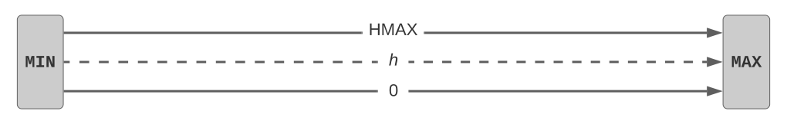
  

  
  
  

  
  
  

  
  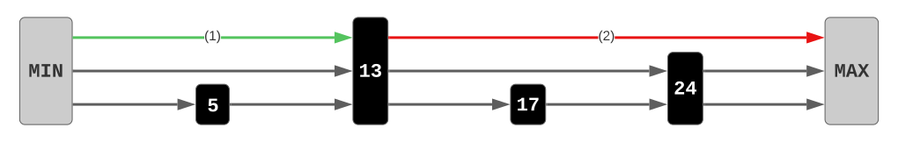
  

  
  
  

  
  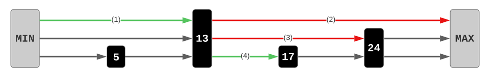
  

 

The skip list is initialized with two sentinel nodes with keys MIN and MAX, defining the valid key range for the structure. The left sentinel contains an array of HMAX entries, each pointing to the right sentinel, initializing HMAX empty linked lists.

As new keys are inserted to the skip list, each list must always remain a sublist of the list directly below it, while the bottom list should contain all keys which have been inserted.

Since each level contains progressively fewer elements of the bottom list, maintaining all lists sorted allows searches in higher levels to skip elements that would otherwise be traversed in a standard linear search. We search in the top level ...

... stop searching when we reach a value equal to or greater than the key ...

... descend to the next level starting from the same element and repeat until we reach the bottom level.

If the key is not found upon reaching the bottom level, then we can conclude that it does not belong to the skip list.

 

---

### JellyFish

  
  The JellyFish skip list implements a map, storing key-value pairs
  

  
  Each node contains a <i>vertical list</i>, a timeline with timestamped values
  

  
  To append a new value, the timestamp must be <i>at least as recent</i> as the head's
  


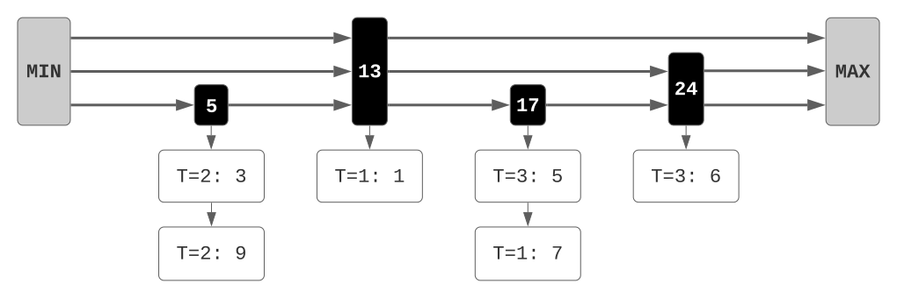


 

Skip lists can also be used to implement key-value stores.

The JellyFish design keeps in each node a list of timestamped values, referred to as a vertical list, representing the timeline of values associated to the key.

The timeline retains its consistency by never appending new values to a vertical list if the new timestamp is less recent than the timestamp found at the head.

 

---

### Concurrent Updates

  
  Updating threads employ lazy synchronization through locks
  

  
  Traversal is done until the bottom, locking the key's predecessor
  

  
  If the key does not exist, then a new node is linked to a random number of levels
  

  
  The lock is released after insertion, locking the predecessor in the next level
  

  
  Insertions are done bottom-up to maintain the sublist relation
  

  
  Updates follow the same initial steps, locking the key's predecessor in the bottom level
  

  
  If a node already exists for the key, then the new value will be appended to the vertical list
  

  
  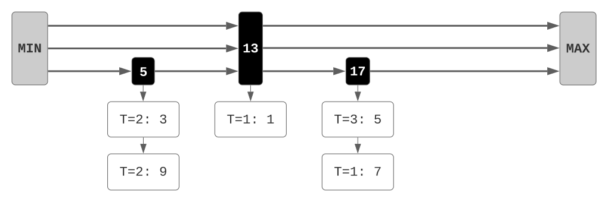
  

  
  
  

  
  
  

  
  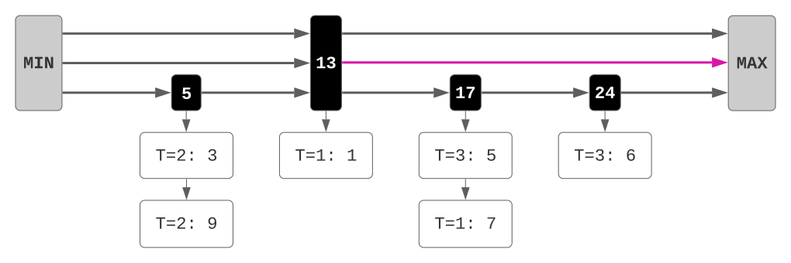
  

  
  
  

  
  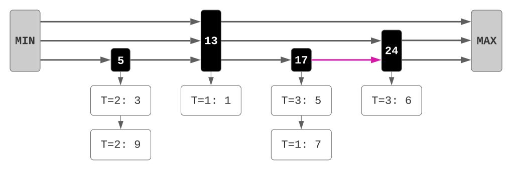
  

  
  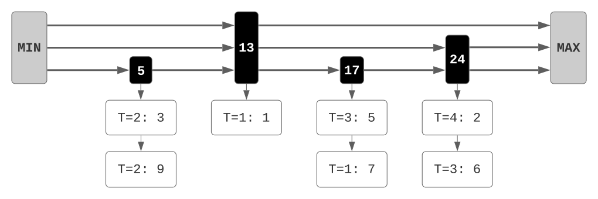
  

 

To ensure that concurrent updates to the data structure alter the state safely, the put operation employs a lazy synchronization strategy using locks. A thread trying to insert key 24 will first traverse the skip list until the bottom level to find its predecessor in key 17 and then ... 

... acquires the node's lock in the bottom level. Since the key has not been found, ...

... a new node is created with some random height. As the predecessor's lock has been acquired, ...

... we can replace its successor by linking the new node to the bottom level. The lock can then be released and the node can be inserted in the upper level.

Insertions are performed bottom-up so as to ensure that the sublist relation is preserved.

A following update on key 24 will repeat the same initial steps by traversing the skip list until the bottom level and locking its predecessor. As the node already exists it will append a new value to its vertical list, ...

... as long as the timestamp is as recent as 3. In short, claiming a node's lock grants exclusive access to update the node's successor at the lock's level, while the bottom level locks also control updates to the value of the node's successor.

 

</section>

---

<section>

## Reasoning about Timestamped Domains

 (continue below) 

 

Having seen how the data is organized in memory, we now abstract from the concrete implementation and discuss how we can reason about concurrent maps in Iris through ghost state.

 

---

### Ghost state in Iris

  
  Ghost state matches the physical state of shared data with an abstract state
  

  
  For concurrent updates to be proven consistent, ghost state is defined as a resource algebra
  

  
  Two elements define a resource algebra (RA):
  

  
  The operator is commutative and associative, making the order of operations irrelevant
  

  
  
  Consider the following ghost variable $a$, which is composed by $f$ and $a^\prime$
  
  

  
  We can split the ghost variable into two separate ghost resources ...
  

  
  ... and perform an update on one of them using the RA operator
  

  
  The resources can be joined to obtain the composition of all elements
  

  
  The elements can be composed in any order, due to commutativity and associativity
  

  
  The local update is equivalent to updating the original decomposed variable
  

  
  
   
  $a$
  $ \ \gamma $
  
  

  
  - **Domain**: type of the ghost variable
  - **Operator**: splits, joins and updates variables
  

  
   
  $ a \cdot b = b \cdot a \qquad \qquad (a \cdot b) \cdot c = a \cdot (b \cdot c)$
  
  

  
   
  $a$
  $ \ \gamma $
  

  
   
  $f \cdot a^\prime$
  $ \ \gamma $
  

  
   
  $f$
  $ \ \gamma $
  $*$
   
  $a^\prime$
  $ \ \gamma $
  

  
   
  $f$
  $ \ \gamma $
  $*$
   
  $a^\prime \cdot x$
  $ \ \gamma $
  

  
   
  $f \cdot a^\prime \cdot x$
  $ \ \gamma $
  

  
   
  $a \cdot x$
  $ \ \gamma $
  

 

In Iris, ghost state provides a way of matching the physical state of shared data with an abstract state where certain properties must hold.

These properties are upheld by modelling ghost state as a resource algebra.

A resource algebra can be defined by indicating a domain and a binary operator for that domain.

We enforce the operator to be both commutative and associative, which allows us to avoid considering all possible orders of execution for multiple concurrent operations.

If we manage to decompose a ghost variable "a" using the resource algebra operator ...

... then we can split it into two separate variables. 

A thread can then ...

... perform an update "x" on one of them without altering the other one ...

... and rejoin both resources to obtain the full view of the updated variable. Since the operator is commutative and associative, we can compose the operands by whichever order we choose. 

As such, we can assert that the resulting state of the variable is equivalent to the initial state updated by "x".

In other words, the update performed by a thread on a partial view is equivalent to an update to the full view.

 

---

### Map Composition

  
  We need to consider map composition to abstract the physical state of JellyFish
  

  
  For different keys, the combined map will contain both key-value pairs
  

  
  But what happens when both threads associate different values to the same key?
  

  
  The key will be associated to the composition of both values using another RA
  

  
  
  $ M_1 \cdot M_2 = M_1 \cup M_2 $
  
  

  
  
  $ \{ \ k_1 : x \ \} \cup \{ \ k_2 : y \ \} $
  
  

  
  
  $ \{ \ k : x \ \} \cup \{ \ k : y \ \} $
  
  

  
  
  $ \{ \ k : x \cdot y \ \} $
  
  

 

To verify JellyFish, we need to consider a suitable resource algebra to abstract concurrent maps.

If the threads hold no key in common, then the combined map is simply a map containing all key-value pairs of both threads.

However, when there exists some key in common, the associated value may differ in both views. 

This issue can be resolved by returning a new map entry where the associated value is the composition of both values. Therefore, we need to define a resource algebra for values of the map.

 

---

### Value Composition

  
  Keys are associated to their most recent value, which will have the greatest timestamp
  

  
  If $i < j$, then the pair with value $a$ is discarded, returning the pair with value $b$
  

  
  For equal timestamps, both values are possible, depending on the scheduler
  

  
  As a result, the abstract map associates each key to a *set* of possible values
  

  
  A unit element is also necessary to apply the update rules on maps
  

  
  The $\textsf{argmax}$ operator returns that value
  

  
  
  $ (a, i) \cdot (b, j) = (b, j) $
  
  

  
  
  
  $ (a, i) \cdot (b, i) = (a \cup b, i) $
  
  
  

  
  
  $ (a, i) \cdot \textsf{botZ} = (a, i) $
  
  

 

As we've seen previously, JellyFish always maintains its most recent value at the head of its vertical list. The abstract map should thus associate each key to the value with the greatest timestamp, meaning that the resource algebra operator for value composition should be the argmax operator.

Values should be represented as pairs, where timestamp "j" being greater than timestamp "i" returns the pair with value "b", discarding the value "a".

However, when both timestamps are equal, the value left at the head of the vertical list will depend on the scheduler. As such, both "a" and "b" may be the value associated to the key, so ...

... we require "a" and "b" to be sets rather than the actual values. In that way, we can maintain each key associated to all possible values, along with the corresponding timestamp "i".

Finally, we define a unit element, as it is necessary to complete the proofs, due to the update rules on maps. To the best of our knowledge, this is the first effort to formalize the argmax resource algebra.

 

</section>

---

<section>

## Map Specification

 (continue below) 

 

Based on these resource algebras, we now define a specification for JellyFish.

 

---

### Map Resources

  
  We define the following representation predicate:
  

  
  $p$ is the left sentinel pointer
  

  
  $M$ reflects partial knowledge of the map
  

  
  $q$ is a fraction between $0$ and $1$
  

  
  $\gamma$ refers to the required ghost state
  

  
  
  These resources can be split into smaller fractions ...
  
  

  
  ... and combined to obtain the larger fractions
  

  
  
  $ \textsf{IsSkipList}(p, M, q, \gamma) $
  
  

  
  
  $ \textsf{IsSkipList}(\textcolor{red}{p}, M, q, \gamma) $
  
  

  
  
  $ \textsf{IsSkipList}(p, \textcolor{red}{M}, q, \gamma) $
  
  

  
  
  $ \textsf{IsSkipList}(p, M, \textcolor{red}{q}, \gamma) $
  
  

  
  
  $ \textsf{IsSkipList}(p, M, q, \textcolor{red}{\gamma}) $
  
  

  
  
  $ \textsf{IsSkipList}(p, M_1 \cup M_2, q_1 + q_2, \gamma) $
  
  

  
  
  $ \downarrow $
  
  

  
  
  $ \uparrow $
  
  



$ \textsf{IsSkipList}(p, M_1, q_1, \gamma) * \textsf{IsSkipList}(p, M_2, q_2, \gamma) $



 

First, we require a representation predicate to describe the known state of the map, called IsSkipList.

IsSkipList is parameterized by the pointer to the left sentinel, which tracks the physical state, ...

... an abstract map, which corresponds to partial knowledge of the full map, ...

... a fraction, which indicates that we hold exclusive ownership of the full map if equal to 1, ...

... and a list of ghost names to keep track of the required ghost state.

This resource can be shared by decomposing the map and splitting the fraction ...

... yielding two new resources.

Separate resources can also be joined to obtain a larger fraction of the skip list.

 

---

### Triple for constructor

  
  The Hoare triple for $\textsf{new}$ is straightforward
  

  
  No resources are needed as a precondition ...
  

  
  ... and we obtain the full fraction of an empty map
  

  
  $ \left\\{ \ \textsf{True} \ \right\\} \\\\ $
  

  
  $ \textsf{new} \\\\ $
  

  
  $ \left\\{ \ p. \ \exists \ \gamma. \ \textsf{IsSkipList}(p, \varnothing, 1, \gamma) \ \right\\} $
  

 

To define the JellyFish specification, we first consider the Hoare triple for the skip list constructor.

This method does not need any initial resources as a precondition ...

... and the postcondition simply asserts exclusive ownership of an empty map, where the return value p corresponds to the left sentinel pointer.

 

---

### Triple for updates

  
  $\textsf{put}$ receives a key, value and timestamp
  

  
  Holding partial knowledge of the map, ...
  

  
  ... $\textsf{put}$ updates the map with the new value
  

  
  Concurrent updates are handled by the RAs
  

  
  $ \left\\{ \ \textsf{IsSkipList}(p, M, q, \gamma) \ \right\\} \\\\ $
  

  
  $ \textsf{put} \ p \ k \ v \ t \\\\ $
  

  
  $ \left\\{ \ \textsf{IsSkipList}(p, M \cup \\{ \ k : (\\{ v \\}, t) \ \\}, q, \gamma) \ \right\\} $
  

 

The put method is parameterized by the updated key, as well as its new value and timestamp.

Its Hoare triple requires an IsSkipList resource to reflect the current knowledge that the thread has of the map.

In the postcondition, this knowledge is updated with a new map entry for the key, associated to a pair containing the new value and timestamp. 

As we've seen in the previous section, the map and argmax resource algebras will handle how the updates of each thread are composed.

 

---

### Triple for lookups

  
  $\textsf{get}$ performs a search for a key
  

  
  We consider exclusive ownership of the map
  

  
  The map remains unchanged after the search
  

  
  The result is empty if the key is not in the map
  

  
  Otherwise, it must be one of the values in the map
  

  
  $ \left\\{ \ \textsf{IsSkipList}(p, M, 1, \gamma) \ \right\\} \\\\ $
  

  
  $ \textsf{get} \ p \ k \\\\ $
  

  
  $ \left\\{ \ v^?. \begin{array}{c} \textcolor{red}{\textsf{IsSkipList}(p, M, 1, \gamma)} * ((v^? = \textsf{None} * M[k] = \textsf{None}) \ \lor \\\\ (\exists \ v, S, t. \ v^? = \textsf{Some}(v, t) * M[k] = \textsf{Some}(S, t) * v \in S)) \end{array} \right\\} $
  

  
  $ \left\\{ \ v^?. \begin{array}{c} \textsf{IsSkipList}(p, M, 1, \gamma) * (\textcolor{red}{(v^? = \textsf{None} * M[k] = \textsf{None})} \ \lor \\\\ (\exists \ v, S, t. \ v^? = \textsf{Some}(v, t) * M[k] = \textsf{Some}(S, t) * v \in S)) \end{array} \right\\} $
  

  
  $ \left\\{ \ v^?. \begin{array}{c} \textsf{IsSkipList}(p, M, 1, \gamma) * ((v^? = \textsf{None} * M[k] = \textsf{None}) \ \lor \\\\ \textcolor{red}{(\exists \ v, S, t. \ v^? = \textsf{Some}(v, t) * M[k] = \textsf{Some}(S, t) * v \in S)}) \end{array} \right\\} $
  

 

Finally, the get method performs a lookup for the current value of some key.

Since an updating thread might immediately invalidate the result of a search, we only consider the case where we hold exclusive ownership of the skip list ...

... which we maintain in the postcondition, as the search operation should not alter the state of the data.

If the key does not exists in the map, then the search must come up empty.

Otherwise, the return result and the entry in the abstract map should agree on the timestamp. We can only assert that the value returned by the search must be one of the possible values associated to the key, since we cannot disambiguate between updates done with the same timestamp.

 

</section>

---

<section>

## Representation Predicate

 (continue below) 

 

We will now see the underlying definition for the IsSkipList predicate.

 

---

### Left Sentinel

  
  The parameter $p$ points to the left sentinel node
  

  
  The pointer must be persistent
  

  
  The left sentinel must have key $\textsf{MIN}$
  

  
  
  $ \exists \ head. \ p \hookrightarrow_\square head * head\textsf{.key} = \textsf{MIN} $
  
  

  
  
  $ \exists \ head. \ \textcolor{red}{p \hookrightarrow_\square head} * head\textsf{.key} = \textsf{MIN} $
  
  

  
  
  $  \exists \ head. \ p \hookrightarrow_\square head * \textcolor{red}{head\textsf{.key} = \textsf{MIN}} $
  
  

 

The left sentinel should be a node stored in the memory location aliased by the paramenter "p".

The corresponding points-to assertion is made persistent, since "p" should always point to the same node.

We guarantee that the node is, in fact, the left sentinel by asserting that its key is equal to the minimum value.

 

---

### Iris Invariants

  
  Shared resources are expressed in Iris through invariants
  

  
  Invariant assertions are kept within a solid border ...
  

  
  ... and associated to a given namespace
  

  
  
  $ I $
  $ \ \mathcal{N} $
  

  
  
  $ I $
  $ \ \mathcal{N} $
  

  
  
  $ I $
  $ \ \textcolor{red}{\mathcal{N}} $
  

 

The remaining nodes of the skip list, however, may change depending on the operations performed by different threads. To reason about shared mutable resources ...

... Iris allows the definition of invariants ...

... which are associated to namespaces.

 

---

### Bottom List

  
  Each level will contain its own invariant describing the level's linked list
  

  
  Each invariant will have a unique namespace provided by $\textsf{levelN}$
  

  
  A unique invariant is defined for the bottom list, describing the full map
  

  
  The invariant requires the left sentinel node ...
  

  
  ... and the ghost names for the bottom level
  

  
  
  $\textsf{BotListInv}(head, \gamma^0) $
  $ \ \textsf{levelN}(0) $
  

  
  
  $\textsf{BotListInv}(head, \gamma^0) $
  $ \ \textcolor{red}{\textsf{levelN}(0)} $
  

  
  
  $\textcolor{red}{\textsf{BotListInv}}(head, \gamma^0) $
  $ \ \textsf{levelN}(0) $
  

  
  
  $\textsf{BotListInv}(\textcolor{red}{head}, \gamma^0) $
  $ \ \textsf{levelN}(0) $
  

  
  
  $\textsf{BotListInv}(head, \textcolor{red}{\gamma^0}) $
  $ \ \textsf{levelN}(0) $
  

 

Since each level can be seen as its own linked list, we define a unique invariant per level ...

... which will be associated to its own invariant namespace.

Unlike the sublists, the bottom level represents the full map, so it will have its own invariant definition ...

... parameterized by the left sentinel node ...

... and the ghost names for the bottom level.

 

---

### Sublists

  
  Each sublist invariant will be defined with the same predicate
  

  
  The sublist invariant and namespace are parameterized by the current level
  

  
  The ghost names from the current level and its lower level are both required
  

  
  
  $ \textsf{SublistInv}(lvl, head, \gamma^{lvl}, \gamma^{lvl-1}) $
  $ \ \textsf{levelN}(lvl) $
  

  
  
  $ \textsf{SublistInv}(\textcolor{red}{lvl}, head, \gamma^{lvl}, \gamma^{lvl-1}) $
  $ \ \textcolor{red}{\textsf{levelN}(lvl)} $
  

  
  
  $ \textsf{SublistInv}(lvl, head, \textcolor{red}{\gamma^{lvl}}, \textcolor{red}{\gamma^{lvl-1}}) $
  $ \ \textsf{levelN}(lvl) $
  

 

For the remaining levels, we use a different invariant definition ...

... which is parameterized by the considered level.

Besides the level's ghost names, the invariant also requires the ghost names for the lower level to reason about the sublist relation.

 

---

### Definition

  
  $\textsf{IsSkipList}$ is thus defined with ...
  

  
  ... the left sentinel assertions, ...
  

  
  ... the bottom list invariant, ...
  

  
  ... the invariants for all sublists and ...
  

  
  ... a ghost variable for a partial view of the map
  


$ \textsf{IsSkipList}(p, M, q, \gamma) \triangleq $


$ \exists \ head. \ p \hookrightarrow_\square head * head\textsf{.key} = \textsf{MIN} $


$*$



 
$ \circ_q \ M $
$ \ \gamma^0_F $


$*$



$\textsf{BotListInv}(head, \gamma^0) $
$ \ \textsf{levelN}(0) $


$*$




$ \mathop{\Huge\ast}\limits_{lvl = 1}^{\textsf{HMAX}} $

$ \textsf{SublistInv}(lvl, head, \gamma^{lvl}, \gamma^{lvl-1}) $
$ \ \textsf{levelN}(lvl) $


 

The IsSkipList predicate can thus be defined by joining all these pieces together ...

... the left sentinel assertions ...

... the bottom list invariant ...

... the sublist invariants for all remaining levels ...

... and also a ghost variable for the partial view of the map which we will now discuss while defining the bottom list invariant.

 

</section>

---

<section>

## Bottom List Invariant

 (continue below) 

 

For the bottom list invariant, we need to match the physical state of JellyFish with the map abstraction.

 

---

### Authoritative Ghost State

  
  Partial views are obtained through an authoritative resource algebra
  

  
  Resources can be either authoritative ($\bullet$) or fragments ($\circ$)
  

  
  Composition of all fragments yields the authoritative resource
  

  
  Fragments will serve as partial views for the full authoritative map
  

  
  Fragment composition is performed by the underlying RA
  

  
  Fractions indicate whether we have composed all existing fragments
  

  
  
   
  $ \bullet \ a $
  $ \ \gamma $
  $*$
   
  $ \circ \ f $
  $ \ \gamma $
  
  $ \vdash f \preccurlyeq a $
  
  
  

  
  
  $ \circ \ f_1 \cdot \circ \ f_2 = \circ \ (f_1 \cdot f_2) $
  
  

  
  
  $ \circ_{q_1} \ f_1 \cdot \circ_{q_2} \ f_2 = \circ_{q_1 + q_2} \ (f_1 \cdot f_2) $
  
  

 

A partial view of a shared object can be obtained through an authoritative resource algebra.

This algebra contains multiple fragments and an authoritative resource ...

... composed by those fragments.

An authoritative map is thus stored inside the invariant reflecting the full map, while each thread holds its own fragment to reflect its partial view.

Fragments are composed through the underlying resource algebra ...

... and fractions indicate whether we have combined all existing fragments.

 

---

### Set Membership

  
  Set membership assertions are required to verify traversals
  

  
  Fragments express that notion, regardless of the state of the authoritative resource
  


 
$ \bullet \ S $
$ \ \gamma $
$*$
 
$ \circ \ \{ \ node \ \} $
$ \ \gamma $



$ \vdash node \in S $



 

Traversing a list requires a set membership assertion, which we can also obtain from an authoritative resource algebra.

Owning a fragment for a singleton set with the visited node entails that the node belongs to the full set without knowing the concrete state of the set.

 

---

### Key-Value Pairs

  
  A node's vertical list should store some value node at its head
  

  
  The map should associate the node's key to the value node's timestamp ...
  

  
  ... and to a set of values containing the value from the value node
  

  
  
  $ \exists \ v. \ node\textsf{.val} \hookrightarrow_{\frac{1}{2}} v $
  
  

  
  
  $ \exists \ vs. \ M[node\textsf{.key}] = \textsf{Some}(vs, v\textsf{.ts}) $
  
  

  
  
  $ v\textsf{.val} \in vs $
  
  

 

Each node of the set should have a value stored in the head of its vertical list.

The corresponding map entry should agree with the node's timestamp, while keeping a set of possible values ...

... containing the actual value stored in memory.

 

---

### Sortedness

  
  The set is a sorted list, including the sentinels
  

  
  
  $ L_\textsf{cat} \triangleq [head] +\kern-1.3ex+\kern0.8ex L +\kern-1.3ex+\kern0.8ex [\textsf{tail}] $
  
  

 

The set must also reflect a sorted list, with all keys confined within both sentinel nodes.

 

---

### Successor Chain

  
  Each physical node should point to its successor in the abstract list
  

  
  The array entry is mutable and stores a pointer for some successor node
  

  
  The successor pointer is immutable and must point to the corresponding successor
  


$ \textsf{IsNext}(lvl, pred, succ) \triangleq $


$ \exists \ s. \ pred\textsf{.next}[lvl] \hookrightarrow_{\frac{1}{2}} s $


$ * \ s \hookrightarrow_\square succ $


 

The chain of successors obtained by each node's pointer should reflect the order of this list.

The corresponding array entry is mutable, storing a pointer for the successor in the list.

This successor pointer should be immutable, since multiple nodes might point to the same node at different levels.

 

---

### Lock Resources

  
  Each node holds a lock for the given level, along with the corresponding lock invariant
  

  
  The lock resources include the node's successor and the successor's value
  

  
  Both pointers are fractional to allow read access to threads which have not acquired the lock
  

  
  
  $ \textsf{HasLock}(lvl, node, R) \triangleq \exists \ \gamma, l. \begin{array}{c} node\textsf{.lock}[lvl] \hookrightarrow_\square l \ * \\ \textsf{IsLock}(\gamma, l, R(node, lvl)) \end{array} $
  
  

  
  
  $ \textsf{InBotLock}(n, 0) \triangleq \exists \ s, succ. \begin{array}{c} n\textsf{.next}[0] \hookrightarrow_{\frac{1}{2}} s * s \hookrightarrow_\square succ \ * \\ (succ = \textsf{tail} \lor \exists \ v. \ succ\textsf{.val} \hookrightarrow_{\frac{1}{2}} v) \end{array} $
  
  

 

Each node should contain a lock for the level, which maintains the lock invariant with some resources.

For bottom list nodes, the resources protected by the lock are the node's successor and the vertical list of this successor.

The points-to assertions are fractional allowing other threads to read their contents without acquiring the lock, while a locking thread will obtain write access to those memory positions.

 

---

### Invariant Definition

  
  $\textsf{BotListInv}$ is thus defined with ...
  

  
  ... the authoritative map, ...
  

  
  ... the authoritative set, ...
  

  
  ... their node-wise equivalence, ...
  

  
  ... the sorted list, ...
  

  
  ... the successor chain and the lock resources ...
  

  
  ... and a set of tokens for the sublist relation
  



$ \textsf{BotListInv}(head, \gamma) \triangleq \exists \ M, S, L. $



 
$ \bullet \ M $
$ \ \gamma_F^{\phantom{0}} $



$ * $




$ M\textsf{.keys} = S\textsf{.keys} \ * $




 
$ \textsf{KeyRange} \setminus S\textsf{.keys} $
$ \ \gamma_T^{\phantom{0}} $
$*$


 
$ \bullet \ S $
$ \ \gamma_A^{\phantom{0}} $


$*$



$ S \equiv_P L * \ \textsf{Sorted}(L_\textsf{cat}) \ * $





$
\mathop{\Huge\ast}\limits_{i = 0}^{|L|}
\left( 
  \begin{matrix}
    \textsf{IsNext}(0, L_\textsf{cat}[i], L_\textsf{cat}[i+1]) \ * \\
    \textsf{HasLock}(0, L_\textsf{cat}[i],  \textsf{InBotLock})
  \end{matrix}
\right) \ * 
$




$
\mathop{\Huge\ast}\limits_{n \in S}
\left( 
  \exists \ v, vs.
  \begin{matrix}
    n\textsf{.val} \hookrightarrow_{\frac{1}{2}} v * v\textsf{.val} \in vs \ * \\
    M[n\textsf{.key}] = \textsf{Some}(vs, v\textsf{.ts})
  \end{matrix}
\right)
$



 

The bottom list invariant is thus defined by combining all elements:

The authoritative map, ...

... the authoritative set ...

and the equivalence between both.

The sortedness assertion, ...

... as well as the successor chain and lock assertions.

There is also a set of tokens, required for the sublist relation between consecutive levels ...

 

</section>

---

<section>

## Sublist Invariant

 (continue below) 

 

... which will now be the focus of our attention.

 

---

### Sublist Relation

  
  For two consecutive levels, the upper level must be a sublist of the lower level
  

  
  As such, upper level nodes keep fragments of the lower level's authoritative set
  

  
  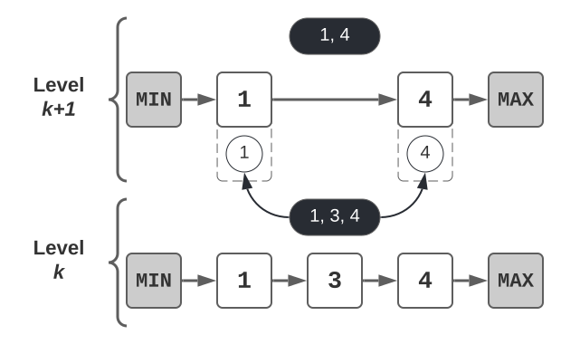
  

  
  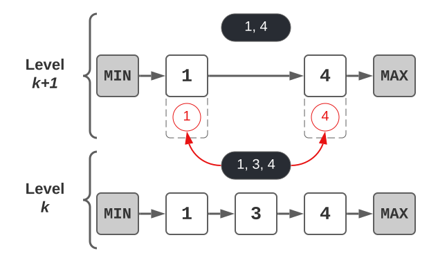
  

 

Each level must contain a sublist of the list contained in its lower level.

For this reason, we associate each sublist node to a fragment of the lower level's authoritative set, expressing the sublist relation.

 

---

### Ghost Tokens

  
  Upon insertion, the code does not check if the key already exists in the upper levels
  

  
  Each level will hold a set of ghost tokens to be removed and associated with upper level nodes
  

  
  Tokens are exclusive, so any new node will have a different token than other existing nodes
  

  
  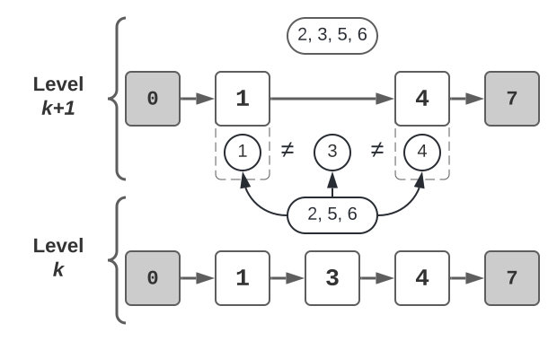
  

  
  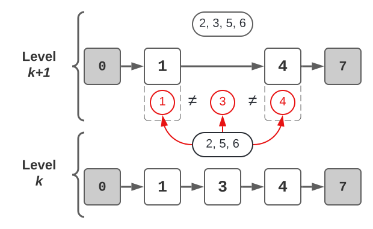
  

  
  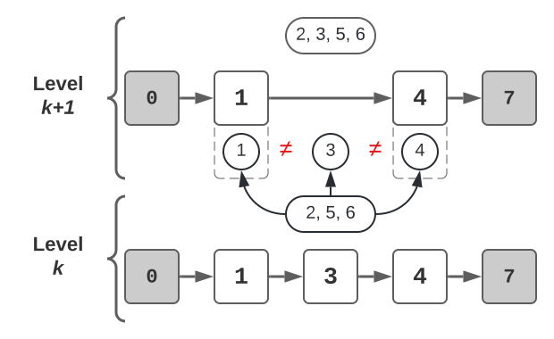
  

 

When inserting in the upper levels, we do not check if the key already exists there, because we already checked the bottom level, which contains all keys.

Since we do not prove this explicitly in the code, we require each level to keep a set of available tokens and associate each sublist node to a lower level token.

By enforcing each token to be exclusive, a new node will require a different token than the tokens for existing nodes, making it safe to insert in any upper level.

 

---

### Lock Resources

  
  The lock resources no longer include the successor's value
  



$ \textsf{InSubLock}(n, lvl) \triangleq \exists \ s. \ n\textsf{.next}[lvl] \hookrightarrow_{\frac{1}{2}} s $



 

The sublist locks only protect the node's successor in that level, leaving the value of the successor to the bottom list locks.

 

---

### Invariant Definition

  
  $\textsf{SublistInv}$ is thus defined with ...
  

  
  ... the authoritative set and sorted list, ...
  

  
  ... the successor chain and the lock resources, ...
  

  
  ... the set of available tokens ...
  

  
  ... and the fragments and tokens of each node
  



$ \textsf{SublistInv}(lvl, head, \Gamma, \gamma) \triangleq \exists \ S, L. $




 
$ \textsf{KeyRange} \setminus S\textsf{.keys} $
$ \ \Gamma_T^{\phantom{0}} $
$*$


 
$ \bullet \ S $
$ \ \Gamma_A^{\phantom{0}} $

$ * \ S \equiv_P L * \ \textsf{Sorted}(L_\textsf{cat}) $



$*$




$
\mathop{\Huge\ast}\limits_{i = 0}^{|L|}
\left( 
  \begin{matrix}
    \textsf{IsNext}(lvl, L_\textsf{cat}[i], L_\textsf{cat}[i+1]) \ * \\
    \textsf{HasLock}(lvl, L_\textsf{cat}[i],  \textsf{InSubLock})
  \end{matrix}
\right)
$




$
* \ \mathop{\Huge\ast}\limits_{n \in S}
\left(
  \vphantom{\begin{matrix}
    n\textsf{.val} \hookrightarrow_{\frac{1}{2}} v * v\textsf{.val} \in vs \ * \\
    M[n\textsf{.key}] = \textsf{Some}(vs, v\textsf{.ts})
  \end{matrix}}
\right. \!
$

 
$ \circ \ \{ n \} $
$ \ \gamma_A^{\phantom{0}} $
$*$
 
$ \{ n\textsf{.key} \} $
$ \ \gamma_T^{\phantom{0}} $

$
\! \! \! \left.
  \vphantom{\begin{matrix}
    n\textsf{.val} \hookrightarrow_{\frac{1}{2}} v * v\textsf{.val} \in vs \ * \\
    M[n\textsf{.key}] = \textsf{Some}(vs, v\textsf{.ts})
  \end{matrix}}
\right)
$



 

The sublist invariant is thus defined with ...

... the same authoritative set and sorted list, ...

... the same successor chain and the lock assertions for the sublist lock resources, ...

... the set of available tokens ...

... and the lower level fragments and tokens for each node.

 

</section>

---

<section>

## Vertical List

 (continue below) 

 

Although the bottom list invariant only accounts for the head of the vertical list, we now show how the remainder of the node's value history is preserved.

 

---

### Update procedure

  
  $\textsf{udpate}$ controls which values are appended to vertical lists
  

  
  Ownership of the initial value is required
  

  

  The update does not occur if the new timestamp is less recent than the head's timestamp
  

  
  Otherwise, the value is appended to the vertical list
  

  
  The chain is made persistent, yielding an immutable history of values
  



$$ \{ \ ... \ node\textsf{.val} \hookrightarrow_{\frac{1}{2}} val \ ... \ \} $$





$$ \ \textsf{update} \ node \ v \ t \ $$



  
  
  $ \left\{ \ ... \ 
  \begin{matrix}
    \textbf{\textsf{if}} \ t < val\textsf{.ts} \ \textbf{\textsf{then}} \ node\textsf{.val} \hookrightarrow_{\frac{1}{2}} val \\
    \phantom{\textbf{\textsf{else}} \ \exists \ p. \ node\textsf{.val} \hookrightarrow_{\frac{1}{2}} (v, t, p) * p \hookrightarrow_\square val}
  \end{matrix}
  \ ... \ \right\} $
  
  

  
  
  $ \left\{ \ ... \ 
  \begin{matrix}
    \textbf{\textsf{if}} \ t < val\textsf{.ts} \ \textbf{\textsf{then}} \ node\textsf{.val} \hookrightarrow_{\frac{1}{2}} val \\
    \textbf{\textsf{else}} \ \exists \ p. \ node\textsf{.val} \hookrightarrow_{\frac{1}{2}} (v, t, p) * p \hookrightarrow_\square val
  \end{matrix}
  \ ... \ \right\} $
  
  

 

An internal procedure is responsible for updating the node's vertical list.

The precondition for its specification includes the points-to assertion for the initial value.

If the new timestamp is less recent than the value already stored, then the update does not occur.

Otherwise, the new value and timestamp are appended to the head.

Asserting that the new value's predecessor is persistent, ensures that the node's value history is immutable by construction.

 

</section>

---

<section>

## Related Work

 (continue below) 

 

I will now highlight some of the most relevant related work.

 

---

### Polaris

  
  Our mechanization is mostly based on the work of [Tassarotti and Harper](https://doi.org/10.1145/3290377) (POPL 2019)

  In their work, they present Polaris, an extension of Iris to support probabilistic reasoning.
  

  
  In Polaris, they proved correctness and probabilistic properties of a 2-level concurrent skip list

  We generalize their correctness proofs to any number levels, simplifying the required ghost state
  

 

Most of our mechanization effort is deeply based on the work of Tassarotti and Harper on Polaris, a probabilistic extension of Iris.

Their work focused more on proving probabilistic properties of a 2-level skip list, while we generalized their arguments to an arbitrary number of levels, simplifying the ghost state for in-level reasoning.

 

---

### Logical Atomicity

  
  Logically atomic triples state that the operation takes place at a single atomic step
  

  
  Non-atomic operations can be seen as atomic, whose changes are caused by that atomic step
  



$ \left\langle \ P \ \right\rangle $
$ \ e \ $
$ \left\langle \ v. \ Q(v) \ \right\rangle $



 

An important correctness criterion for concurrent operations is logical atomicity. Iris allows the definition of logically atomic triples, meaning that a potentially non-atomic operation transforms the precondition into the postcondition at a single atomic step.

That atomic step suffices to reason about interference between concurrent operations, allowing us to treat a non-atomic operation as if it were atomic.

 

---

### Key-Value Specifications

  
  From a logically atomic map specification, [Xiong *et al.*](https://doi.org/10.1007/978-3-662-54434-1_36) (ESOP 2017) derive a key-value specification
  

  
  Such specifications allow reasoning about individual keys rather than the entire state of the map
  

  
  Any algebra (*e.g.*, our $\textsf{argmax}$ RA) can be built on top of the specification to reason about clients
  



$ \left\langle \ \textsf{Key}(p, k, v_i^?, \gamma) \ \right\rangle $
$ \ \textsf{put} \ p \ k \ v \ t \ $
$ \left\langle \ \textsf{Key}(p, k, v_i^? \cdot \textsf{Some}(v, t), \gamma) \ \right\rangle $



 

Xiong et al. define a logically atomic specification for a concurrent map, which they then use to define a key-value specification.

Key-value specifications allow reasoning about composition and sharing of individual keys rather than sharing the entire map.

They also show how to apply client reasoning on top of this specification by constructing a suitable algebra, much like we did with the argmax resource algebra.

 

</section>

---

<section>

## Conclusion

 (continue below) 

 

To conclude, this work contributes to the understanding of complex list-based data structures, providing a new approach for reasoning about concurrent maps.

 

---

### Future Work


- Verifying other skip list implementations (*e.g.*, the original JellyFish)



- Proving logical atomicity for the map operations of lazy JellyFish



- Deriving a key-value specification from the logically atomic map specification



- Constructing new RAs for verifying other types of clients (*e.g.*, producer-consumer)


 

We leave as future work ...

... adapting of our proofs to other skip list implementations, ...

... proving the map operations to be logically atomic, ...

... refactoring the proofs to define a key-value specification ...

... and constructing other expressive resource algebras for client reasoning.

 

</section>

---

# Thank you!

 

Thank you for your attention and I am now available to answer any questions you may have.

 